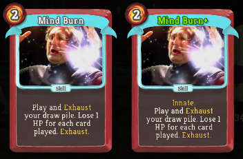
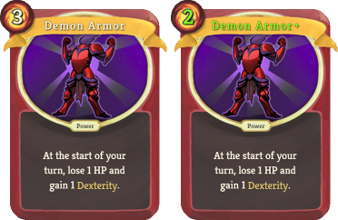

# Custom cards for Slay the Spire

Adds some custom cards designed by the fine people of reddit.

Note that this mod only makes the cards available for drafting, you might not encounter them in a run.
To add a card to your deck like a filthy cheater, you can press backtick (`` ` ``) to open the basemod console, and type

    deck add Mind Burn

## Cards ##

[by pi_rho_man](https://www.reddit.com/r/slaythespire/comments/86fnwa/havoc_op_beta_bug/dw56kfz/)

[by SirBlackMage](https://www.reddit.com/r/slaythespire/comments/892ohq/im_learning_photoshop_and_created_a_custom/)

## Requirements ##
* ModTheSpire (https://github.com/t-larson/ModTheSpire/releases)
* BaseMod (https://github.com/daviscook477/BaseMod/releases)
* Java 8+

## Installation ##
1. [Download `ModTheSpire.jar`](https://github.com/kiooeht/ModTheSpire/releases)
2. Move `ModTheSpire.jar` into your **Slay The Spire** directory. This directory is likely to be found under `C:\Program Files (x86)\Steam\steamapps\common\SlayTheSpire`.
3. Create a `mods` folder in your **Slay The Spire** directory
4. [Download `BaseMod.jar`](https://github.com/daviscook477/BaseMod/releases), and place it in the `mods` folder.
5. [Download `CustomCards.jar`](https://github.com/twanvl/sts-custom-cards/releases), and place it in the `mods` folder.
6. Your modded version of **Slay The Spire** can now be launched by double-clicking on `ModTheSpire.jar`
7. This will open a mod select menu where you need to make sure that both `BaseMod` and `CustomCards` are checked before clicking **play**

## Changelog ##

v1.0.1:
 * Added *Demon Armor*

v1.0.0:
 * Added *Mind Burn*